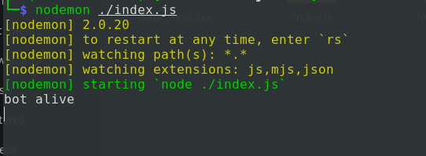
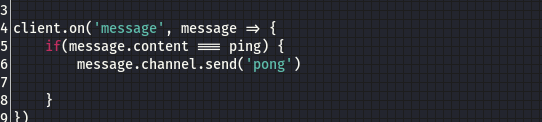

# Discord-Bot
#### Own discord bot can be customized to any needs of any Discord Server

- On your terminal clone repo 'git clone' 

- Move to Discord-Bot folder.

-This process will continue after you have added you bot to your Server.

- To bring Bot to life edit `index.js` token to your token.

- Run `nodemon ./index.js` on terminal to activate bot on your server.

- No errors means that the bot is live on your Server.

- Try to `ping` on channnel to recieve the `pong` message from bot.

- Customize to your own commands by editing the `index.js` client.on function to your inquires.

